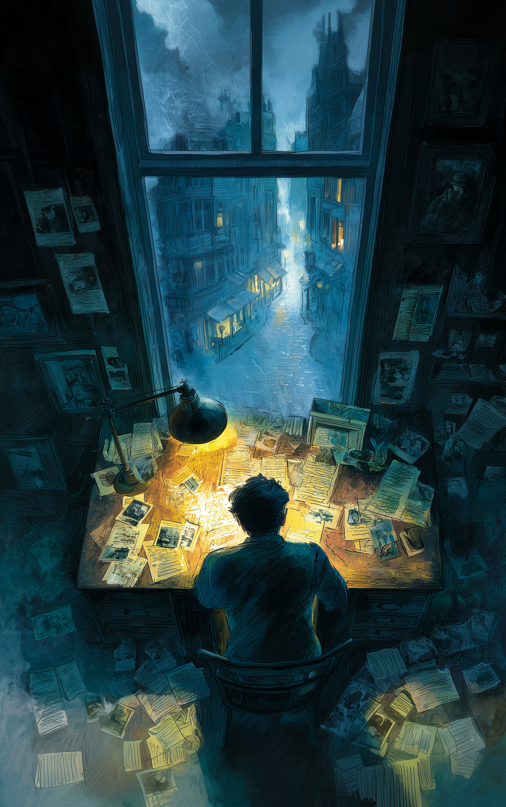
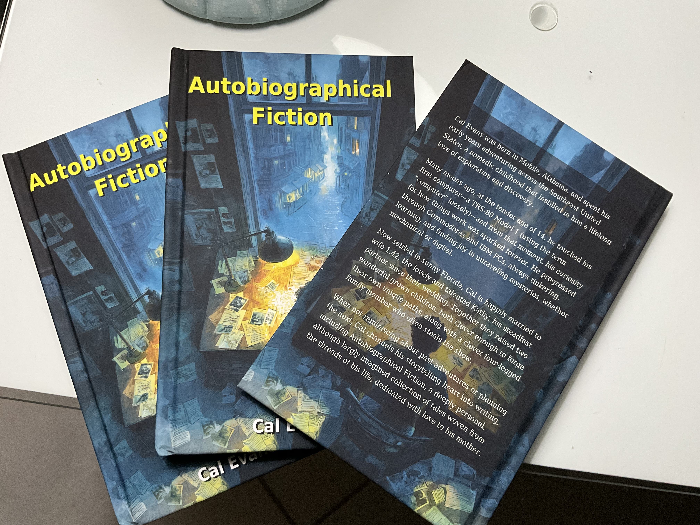

- [Age 5: The Young Boy and the Sea](age-5-the-young-boy-and-the-sea.md)
- [Age 6: The Humpty-Clause](age-6-the-humpty-clause.md)
- [Age 6: The Legend of the Barber Chair](age-6-the-legend-of-the-barber-chair.md)
- [Age 7: Cal Plants A Garden](age-7-cal-plants-a-garden.md)
- [Age 9: …and God Spoke](age-9-and-god-spoke.md)
- [Age 11: The Love of a Child is Timeless](age-11-the-love-of-a-child-is-timeless.md)
- [Age 12: A Public Display of Affection](age-12-a-public-display-of-affection.md)
- [Age 12: Nightmare on SW 167 Terrace](age-12-nightmare-on-sw-167-terrace.md)
- [Age 17: The Surprise Party](age-17-the-surprise-party.md)
- [Age 20: The Origins of Lil ‘J’](age-20-the-origins-of-lil-j.md)
- [Age 52: Hairdryer Hotdogs](age-52-hairdryer-hotdogs.md)

## The Story of the Book

This project started back 20 years or so. I was bored one night, so I decided to write down one of the stories from my childhood as I remembered it. The original prologue for the stories - now lost to history - explained that I was doing it mostly out of boredom and to torture my mother.
  

Originally, they were emails sent to my family. I eventually collected them and published them on a well-hidden website named Autobiographical Fiction. I've moved them around a couple of times, but recently when reorganizing all of my sites, I came across them again and decided it was time for an update.
  

So, thanks to the miracle of AI, I present them here cleaned up, spell-checked, and with cute new covers done in the style of my favorite detective series from the 1960s and 1970s, Alfred Hitchcock and the Three Investigators. Some of them are actually spot on.
  

I showed them to Mom, who got to relive the horrors of my childhood all over again. She laughed until she cried; she threatened to kill me. A good time was had by all.
  

As a late Christmas present, I used AI and Lulu.com to put them all into a book. I also printed copies for my siblings so that their kids will have yet another thing to throw away when we've all gone to Heaven.
  

As the dedication says:
  
"For Mom.
  
Thank you."

